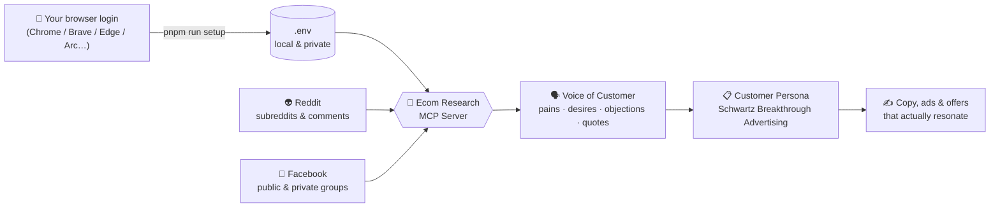

<div align="center">

# 🛒 Ecom Customer Research MCP

### Turn real conversations from **Reddit** & **Facebook groups** into **customer personas** - automatically.

_Listen to your market in their own words. Understand what they really want. Sell with copy that converts._

<br/>


</div>

---

> [!TIP]
> **New here and not technical? You're in the right place.** 👇
> Just follow **[👉 Start Here](#-start-here-read-this-first)** step by step. No coding, no jargon.

# 👉 Start Here (read this first)

**What this does:** it reads the conversations inside your Facebook groups (and Reddit) and turns them into a ready-to-use **customer persona** for your product - written in your customers' own words.

**How it gets into Facebook:** it simply **borrows the Facebook login you already have open in your browser**. It never asks for your password.

> [!TIP]
> **Two sources, no Reddit account needed.** 👽 `pnpm run setup` connects **Reddit** too (it borrows your browser's reddit.com cookies, which gets past Reddit's bot-block - no login or app required). Then just say _"Scrape r/SkincareAddiction and list the 5 biggest customer pains."_ The big setup below is for 📘 **Facebook**, so it can read groups with your own login.

> [!IMPORTANT]
>
> ## 🔑 The one golden rule
>
> The tool can only see what **you** can see in **your own** Facebook account.
>
> ✅ If you can open a group in your browser and read the posts, **the tool can too.**
> ❌ If you can't open it, **the tool can't either.**

## ✅ Before you start, check these 4 things

- [ ] **1. You have a browser.** Google Chrome (or Brave, Edge, or Arc) is installed on this computer.
- [ ] **2. You are logged in to Facebook** in that browser. Open [facebook.com](https://facebook.com): do you see your normal news feed? Then you're logged in. If you see a login screen, **log in first**.
- [ ] **3. For PRIVATE groups: you are already a MEMBER of the group.** 👈 This one is important. The tool **cannot** get into a private group that you yourself have not joined. So first, in Facebook: open the group, click **Join**, answer any membership questions, and **wait until an admin approves you**. Only after you're a member can the tool read it. _(Public groups and Facebook Pages need no membership - anyone can read those.)_
- [ ] **4. You have Claude Code** open with this project folder.

## 🚀 Now do these 3 things

> ### 1. Log in & join
>
> **Log in to Facebook** in your normal browser, and **join every group** you want to research.
>
> ### 2. Connect (one time)
>
> In Claude, type: **_"Set up the Facebook scraper."_**
> It grabs your login from your browser automatically. **You never copy a password or a cookie.**
>
> ### 3. Research
>
> In Claude, type: **_"Scrape this group and build me a customer persona: `<paste the group link>`."_**

🎉 **That's it.** Claude reads the group and hands you a persona you can sell to.

<details>
<summary><b>❓ Where do I find the "group link"?</b></summary>

<br/>

Open the group in your browser. Look at the **address bar** at the very top of the window and copy the whole web address. It looks like this:

```
https://www.facebook.com/groups/123456789
```

Paste that into Claude. That's the group link. 👍

</details>

> [!NOTE]
> The first time on a Mac, a small system pop-up may appear ("Chrome Safe Storage"). That's just macOS asking permission for the tool to read **your own** browser login. Click **Always Allow** (you might type your Mac password once). It's safe, and it only happens once.

## 🆘 Something not working? (the fix for every common snag)

Don't worry, almost every hiccup is one of these. Find your situation on the left.

| What happened                                              | What it means                                             | ✅ What to do                                                                                                                                                                                          |
| ---------------------------------------------------------- | --------------------------------------------------------- | ------------------------------------------------------------------------------------------------------------------------------------------------------------------------------------------------------ |
| **"No Facebook login found"**                              | The tool didn't find a logged-in Facebook in that browser | Open [facebook.com](https://facebook.com) and make sure you're logged in. Then run setup again. If your Facebook is in a **different** browser, tell Claude which one (e.g. _"set it up with Brave"_). |
| **A private group gives nothing / "you must be a member"** | Your account isn't inside that group yet                  | In Facebook, open the group → click **Join** → wait until you're **approved**. Then try again. The tool can't enter a group you haven't joined.                                                        |
| **You use Brave / Edge / Arc, not Chrome**                 | Setup checks Chrome by default                            | Tell Claude: _"set it up with Brave"_ (or edge / arc). Command line: `pnpm run setup brave`.                                                                                                           |
| **You have 2 Facebook accounts or browser profiles**       | Setup uses your main ("Default") profile                  | Log into the **right** account in your main browser window. If your Facebook lives in another profile, tell Claude the profile name (e.g. `pnpm run setup chrome "Profile 1"`).                        |
| **A Mac keychain pop-up appeared**                         | macOS is asking permission to read your own browser login | Click **Always Allow** (type your Mac password if asked). Normal and safe.                                                                                                                             |
| **Facebook shows a "confirm it's you" / security check**   | You went too fast, or Facebook wants to re-verify         | Slow down, run setup again to refresh your login, and make sure you can browse Facebook normally in your own browser.                                                                                  |
| **You logged out or changed your Facebook password**       | Your saved login is no longer valid                       | Log back in to Facebook in your browser, then run setup again.                                                                                                                                         |
| **You used an Incognito / private window**                 | Incognito keeps no saved login                            | Use your **normal** browser window where you're logged in.                                                                                                                                             |
| **`pnpm setup` seems to do nothing**                       | `pnpm setup` is a reserved system command                 | Use **`pnpm run setup`** (with the word "run").                                                                                                                                                        |
| **"Is my login safe?"**                                    | Yes                                                       | Your login is saved **only** on your computer, in a hidden `.env` file. It is never uploaded, committed, or shared.                                                                                    |
| **Reddit - do I need an account?**                         | No                                                        | `pnpm run setup` connects Reddit by borrowing your browser's reddit.com cookies. Visit [reddit.com](https://reddit.com) once in your browser, then run setup.                                          |
| **Reddit still says "403"**                                | Rare: your browser had no reddit.com cookies yet          | Open [reddit.com](https://reddit.com) once in your browser, then re-run `pnpm run setup`. Last resort: [connect a Reddit app](#-reddit-setup-only-if-you-get-a-403).                                   |

> Still stuck? Just **tell Claude what happened in plain words** - it can read the error and walk you through the fix.

---

## 🔧 Reddit setup (only if you get a 403)

**You almost certainly don't need this.** `pnpm run setup` already connects Reddit for you by borrowing your browser's reddit.com cookies, which gets past Reddit's bot-block - **no Reddit account or app needed**. (If you've never opened reddit.com in your browser, do that once, then run setup.)

<details>
<summary>Last resort: connect a free Reddit app (only if Reddit still 403s after setup)</summary>

<br/>

1. Go to **<https://www.reddit.com/prefs/apps>** → **Create another app...**
2. Pick **"script"**, give it any name, and put `http://localhost` as the redirect URI. Click **Create app**.
3. Copy the **client ID** (the string under the app name) and the **secret**.
4. Add them to your `.env`: `REDDIT_CLIENT_ID=...` and `REDDIT_CLIENT_SECRET=...`
5. Done - Reddit now uses the official OAuth API. (Facebook is unaffected.)

</details>

---

## 💬 Talk to it - example prompts

Just chat with Claude in normal language. **Reddit works instantly; Facebook uses the one-time setup above.**

**👽 Reddit (no setup needed):**

```text
"Scrape the top posts and comments from r/SkincareAddiction this month,
 and list the 5 biggest frustrations in customers' own words."
```

**📘 Facebook:**

```text
"Scrape this Facebook group and build me a customer persona:
 https://www.facebook.com/groups/XXXXXXXXX  - my product is a natural sleep supplement."
```

```text
"Find Facebook groups about 'natural skincare', scrape the top discussions,
 and tell me the 5 biggest pains and the exact words people use."
```

```text
"Pull the hottest threads from r/SkincareAddiction and r/30PlusSkinCare,
 then combine them with my Facebook group data into one persona."
```

```text
"From everything you scraped, write 3 ad headlines in the Schwartz style
 that channel their #1 mass desire."
```

```text
"Scrape the comments from this Facebook group and from r/SkincareAddiction,
 and export them all to a CSV: https://www.facebook.com/groups/XXXXXXXXX"
```

## 🧭 How it works



## 🤝 Which Claude can run it?

It's a standard MCP server, so it plugs into any Claude that supports MCP:

| Claude client                     | Works? | Notes                                                                           |
| --------------------------------- | :----: | ------------------------------------------------------------------------------- |
| **Claude Code**                   |   ✅   | Full experience, including the automatic browser-login pickup. **Recommended.** |
| **Claude Desktop**                |   ✅   | Runs locally too, so the auto-login works. Add it as a local MCP server.        |
| **Claude Cowork** / **claude.ai** |  ✅\*  | Add it as an MCP connector.                                                     |

> [!NOTE]
> \*With **Cowork / claude.ai**, MCP connectors run in Anthropic's cloud, not on your computer, so they can't read your local browser. The one-time **auto-login pickup (`pnpm run setup`) is a local feature** - run it once on your own machine (via Claude Code or Claude Desktop) to get your `FACEBOOK_COOKIE`, then paste that into the Cowork connector's settings. After that, scraping works the same everywhere.

## 🛠️ What's inside

Three toolsets your Claude can use:

### 👽 Reddit tools · _no login, works instantly_

| Tool                                                     | What it does                                                   |
| -------------------------------------------------------- | -------------------------------------------------------------- |
| `browse_subreddit`                                       | Browse a subreddit by hot / new / top / rising / controversial |
| `get_top_posts`                                          | Top posts from a subreddit or the Reddit home feed             |
| `search_reddit`                                          | Search all of Reddit for posts on any topic                    |
| `get_post_comments`                                      | Get a post's full comment thread                               |
| `get_reddit_post`                                        | A single post with engagement analysis                         |
| `get_subreddit_info`                                     | Subreddit stats and community insights                         |
| `get_trending_subreddits`                                | What's trending on Reddit right now                            |
| `get_user_info` · `get_user_posts` · `get_user_comments` | Research a specific Reddit user                                |

> ✍️ **Optional write tools** (need your Reddit username/password, with built-in spam-safe mode): `create_post` · `reply_to_post` · `edit_post` · `edit_comment` · `delete_post` · `delete_comment`.

### 📘 Facebook tools · _uses your browser login_

| Tool                         | What it does                                                |
| ---------------------------- | ----------------------------------------------------------- |
| `facebook_get_group_posts`   | Scrape recent posts from a **public or private** group feed |
| `facebook_get_post_comments` | Scrape the full **comment thread** of a post                |
| `facebook_get_group_info`    | Group name, privacy, member count, description              |
| `facebook_search_groups`     | Find groups by niche/keyword                                |
| `facebook_get_page_posts`    | Scrape a public **Page** feed (e.g. a competitor)           |
| `test_facebook_connection`   | Check your login / engine status                            |

### 🎯 Customer-persona tools (Schwartz _Breakthrough Advertising_) · _Reddit, Facebook, or both_

| Tool                        | What it does                                                                                                                                                                                                                                                              |
| --------------------------- | ------------------------------------------------------------------------------------------------------------------------------------------------------------------------------------------------------------------------------------------------------------------------- |
| `analyze_voice_of_customer` | Mine any text into **pains, desires, objections, questions, triggers, quotes**                                                                                                                                                                                            |
| `build_customer_persona`    | Build a full persona brief from **posts + their comments**: **mass desire**, the **5 awareness stages**, the **5 sophistication levels**, and headline angles                                                                                                             |
| `export_comments_csv`       | Scrape Facebook groups and/or subreddits to a **CSV** - one row per **post and comment**, linked by a shared `post_id` (+ `row_type`), with author, timestamp, category and text. Sort by `post_id` to see each post with its comments. Low-value reactions filtered out. |

> 💡 Mix sources freely - combine Reddit threads and Facebook group discussions into one persona or one CSV.

## 🧠 The framework: why "personas," done right

Eugene Schwartz's first rule of advertising:

> _"You cannot create desire - you can only channel the desires that already exist in the mind of the prospect."_

So instead of guessing, this tool **extracts** the desire that's already there and maps your market on two axes Schwartz made famous:

- **5 States of Awareness** - from _Unaware_ → _Problem-Aware_ → _Solution-Aware_ → _Product-Aware_ → _Most-Aware_. Tells you **where to start the conversation**.
- **5 Stages of Sophistication** - how many claims your market has already heard. Tells you **how to position your claim/mechanism** so it still lands.

The output is an evidence-backed brief Claude turns into your persona - quoting your customers verbatim, never inventing.

---

## ⚙️ Advanced configuration

<details>
<summary><b>🔑 Facebook session options</b></summary>

The easiest path is `pnpm run setup`. Under the hood it fills these in `.env`:

| Variable                                   | Description                                                                                                                  |
| ------------------------------------------ | ---------------------------------------------------------------------------------------------------------------------------- |
| `FACEBOOK_COOKIE`                          | Full cookie header for your logged-in session (set automatically by setup). Required for private groups.                     |
| `FACEBOOK_COOKIE_FROM`                     | Auto-read cookies from a browser **on every start**: `chrome` · `brave` · `edge` · `arc` · `chromium` · `vivaldi` · `opera`. |
| `FACEBOOK_COOKIE_FROM_PROFILE`             | Browser profile name (default `Default`).                                                                                    |
| `FACEBOOK_ENGINE`                          | `auto` (default) · `http` (lightweight) · `browser` (Playwright - best for private groups).                                  |
| `FACEBOOK_HEADLESS`                        | Run the browser engine hidden (default `true`).                                                                              |
| `FACEBOOK_MIN_DELAY_MS`                    | Delay between requests to stay friendly to Facebook (default `4000`).                                                        |
| `FACEBOOK_CACHE` / `FACEBOOK_CACHE_MAX_MB` | In-memory response cache (default `on` / `50`).                                                                              |

**How cookie auto-pickup works:** the tool reads your browser's local cookie database and lets the browser (or your OS keychain) decrypt it - so you never copy-paste secrets. Cross-platform (macOS Keychain / Windows DPAPI / Linux).

</details>

<details>
<summary><b>⌨️ Command-line setup (instead of asking Claude)</b></summary>

```bash
pnpm install
pnpm run setup                # auto-detects your browser & grabs your Facebook login
# pick a browser:             pnpm run setup brave
# pick a specific profile:    pnpm run setup chrome "Profile 1"
```

Supported browsers: **Chrome, Brave, Edge, Arc, Chromium, Vivaldi, Opera**. Re-run `pnpm run setup` anytime you log in again.

</details>

<details>
<summary><b>👽 Reddit configuration (auth tiers, safe mode, bot disclosure)</b></summary>

| Variable                                    | Default     | Description                                    |
| ------------------------------------------- | ----------- | ---------------------------------------------- |
| `REDDIT_AUTH_MODE`                          | `auto`      | `auto` · `authenticated` · `anonymous`         |
| `REDDIT_CLIENT_ID` / `REDDIT_CLIENT_SECRET` | –           | Reddit app creds (higher rate limits)          |
| `REDDIT_USERNAME` / `REDDIT_PASSWORD`       | –           | For posting/commenting                         |
| `REDDIT_SAFE_MODE`                          | `standard`  | Spam protection: `off` · `standard` · `strict` |
| `REDDIT_BOT_DISCLOSURE`                     | `off`       | Append a bot footer to posts: `auto` · `off`   |
| `REDDIT_CACHE` / `REDDIT_CACHE_MAX_MB`      | `on` / `50` | Read-response caching                          |

| Mode             | Rate limit     | Setup    | Best for      |
| ---------------- | -------------- | -------- | ------------- |
| `anonymous`      | ~10 req/min    | none     | quick testing |
| `auto` (default) | 10–100 req/min | optional | flexible      |
| `authenticated`  | 60–100 req/min | required | production    |

</details>

<details>
<summary><b>🧰 Manual MCP config &amp; HTTP / Docker</b></summary>

The repo ships a ready-to-use `.mcp.json` (Claude Code auto-loads it). To register manually elsewhere:

```json
{
  "mcpServers": {
    "ecom-research": {
      "command": "node",
      "args": ["./dist/index.js"],
      "env": { "FACEBOOK_ENGINE": "browser" }
    }
  }
}
```

**HTTP server mode** (Docker / web clients):

```bash
TRANSPORT_TYPE=httpStream PORT=3000 node dist/index.js
# optional OAuth: OAUTH_ENABLED=true OAUTH_TOKEN=...
```

</details>

## 🔒 Privacy & responsible use

> [!WARNING]
> This tool is for **aggregate customer research** - understanding a market, not individuals.

- Only access groups you're **legitimately a member of**.
- Don't de-anonymize people or republish their posts verbatim as your own.
- Scraping may conflict with a platform's Terms of Service - use responsibly and at your own discretion.
- Reddit data must not be used for AI training or resale (per Reddit's Responsible Builder Policy).

## 🧑‍💻 For developers

<details>
<summary><b>Stack &amp; commands</b></summary>

TypeScript · [FastMCP](https://github.com/punkpeye/fastmcp) · Playwright (Facebook browser engine) · Cheerio (HTML parsing) · functype · Zod · Vitest.

```bash
pnpm install        # install deps
pnpm run setup      # connect your Facebook login
pnpm build          # build
pnpm test           # run tests
pnpm validate       # format + lint + typecheck + test + build
pnpm serve:dev      # run from source (tsx)
```

**Architecture:** `src/facebook/` (client, engines, parsers, cookie-extractor, formatters) · `src/persona/schwartz.ts` (voice-of-customer mining + framework) · `src/client/` (Reddit) · `src/index.ts` (MCP tools). See `CLAUDE.md` for the full map.

</details>

## 🙏 Credits

Built on top of [reddit-mcp-server](https://github.com/jordanburke/reddit-mcp-server) by Jordan Burke. Facebook group scraping, the multi-browser cookie auto-setup, and the Schwartz persona engine are additions in this fork.

Persona methodology: _Breakthrough Advertising_ by Eugene M. Schwartz.

<div align="center">

---

**Made for e-commerce operators who'd rather listen than guess.** 🛒

</div>
