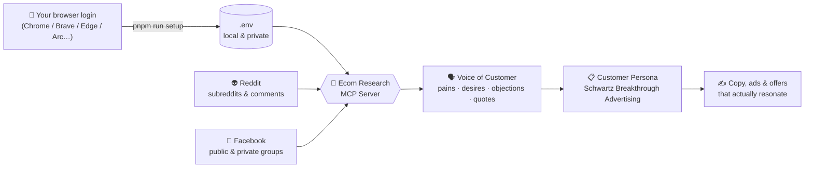

<div align="center">

# 🛒 Ecom Customer Research MCP

### Turn real conversations from **Reddit** & **Facebook groups** into **customer personas** - automatically.

_Listen to your market in their own words. Understand what they really want. Sell with copy that converts._

<br/>


</div>

---

> [!TIP]
> **Not technical? That's fine.** You don't need to write code. Skip to **[🚀 Quick Start](#-quick-start-no-coding-needed)** - open the folder in Claude, say _"set up the Facebook scraper"_, and start researching.

## 💡 Why this exists

Great e-commerce copy isn't invented - it's **overheard**. Your future customers are already describing their pains, desires, and objections in Reddit threads and Facebook groups, in their own words.

This tool reads those conversations for you and organizes them into a **customer persona** using Eugene Schwartz's legendary _Breakthrough Advertising_ framework - so you know exactly **what to say, to whom, and when**.

<table>
<tr>
<td width="33%" valign="top">

### 👂 Listen

Scrape discussions from **Reddit** and **public _and_ private Facebook groups** you're a member of.

</td>
<td width="33%" valign="top">

### 🧠 Understand

Auto-mine **voice of customer**: pains, desires, objections, questions, emotional triggers, and verbatim quotes.

</td>
<td width="33%" valign="top">

### 🎯 Sell

Get a **Schwartz persona**: mass desire, awareness stage, sophistication level + ready-to-use headline angles.

</td>
</tr>
</table>

## 🧭 How it works



## 🚀 Quick Start (No Coding Needed)

**You need:** a browser (Chrome, Brave, Edge, Arc…), a Facebook account that's a member of the groups you want to research, and [Claude Code](https://claude.com/claude-code) (also works with Claude Desktop and Cowork - see [Which Claude can run it?](#-which-claude-can-run-it)).

|     | Step         | What to do                                                                                                                                               |
| --- | ------------ | -------------------------------------------------------------------------------------------------------------------------------------------------------- |
| 1️⃣  | **Open**     | Open this folder in **Claude Code**.                                                                                                                     |
| 2️⃣  | **Log in**   | Make sure you're **logged into Facebook** in your normal browser.                                                                                        |
| 3️⃣  | **Set up**   | Tell Claude: _**"Set up the Facebook scraper."**_ It runs `pnpm install` + `pnpm run setup` and grabs your login automatically - **no cookies to copy**. |
| 4️⃣  | **Research** | Ask away (see prompts below). 🎉                                                                                                                         |

> [!IMPORTANT]
> On a Mac you may see a **one-time** _"Chrome Safe Storage"_ keychain prompt during setup - click **Always Allow**. Your login is saved **only** to a local, git-ignored `.env` file. It's never uploaded or committed.

<details>
<summary><b>⌨️ Prefer the command line?</b></summary>

```bash
pnpm install
pnpm run setup                # auto-detects your browser & grabs your Facebook login
# pick a browser:             pnpm run setup brave
# pick a specific profile:    pnpm run setup chrome "Profile 1"
```

Supported browsers: **Chrome, Brave, Edge, Arc, Chromium, Vivaldi, Opera**. Re-run `pnpm run setup` anytime you log in again.

</details>

## 🤝 Which Claude can run it?

It's a standard MCP server, so it plugs into any Claude that supports MCP:

| Claude client                     | Works? | Notes                                                                           |
| --------------------------------- | :----: | ------------------------------------------------------------------------------- |
| **Claude Code**                   |   ✅   | Full experience, including the automatic browser-login pickup. **Recommended.** |
| **Claude Desktop**                |   ✅   | Runs locally too, so the auto-login works. Add it as a local MCP server.        |
| **Claude Cowork** / **claude.ai** |  ✅\*  | Add it as an MCP connector.                                                     |

> [!NOTE]
> \*With **Cowork / claude.ai**, MCP connectors run in Anthropic's cloud, not on your computer, so they can't read your local browser. The one-time **auto-login pickup (`pnpm run setup`) is a local feature** - run it once on your own machine (via Claude Code or Claude Desktop) to get your `FACEBOOK_COOKIE`, then paste that into the Cowork connector's settings. After that, scraping works the same everywhere.

## 💬 Talk to it - example prompts

Once it's set up, just chat with Claude:

```text
"Scrape this Facebook group and build me a customer persona:
 https://www.facebook.com/groups/XXXXXXXXX  - my product is a natural sleep supplement."
```

```text
"Find Facebook groups about 'natural skincare', scrape the top discussions,
 and tell me the 5 biggest pains and the exact words people use."
```

```text
"Pull the hottest threads from r/SkincareAddiction and r/30PlusSkinCare,
 then combine them with my Facebook group data into one persona."
```

```text
"From everything you scraped, write 3 ad headlines in the Schwartz style
 that channel their #1 mass desire."
```

## 🛠️ What's inside

### 📘 Facebook tools

| Tool                         | What it does                                                |
| ---------------------------- | ----------------------------------------------------------- |
| `facebook_get_group_posts`   | Scrape recent posts from a **public or private** group feed |
| `facebook_get_post_comments` | Scrape the full **comment thread** of a post                |
| `facebook_get_group_info`    | Group name, privacy, member count, description              |
| `facebook_search_groups`     | Find groups by niche/keyword                                |
| `facebook_get_page_posts`    | Scrape a public **Page** feed (e.g. a competitor)           |
| `test_facebook_connection`   | Check your login / engine status                            |

### 🎯 Customer-persona tools (Schwartz _Breakthrough Advertising_)

| Tool                        | What it does                                                                                                                  |
| --------------------------- | ----------------------------------------------------------------------------------------------------------------------------- |
| `analyze_voice_of_customer` | Mine any text into **pains, desires, objections, questions, triggers, quotes**                                                |
| `build_customer_persona`    | Build a full persona brief: **mass desire**, the **5 awareness stages**, the **5 sophistication levels**, and headline angles |

> 💡 These work on **Reddit, Facebook, or both** - feed them whatever you scraped.

<details>
<summary><b>👽 Reddit tools (read &amp; write)</b></summary>

**Read:** `get_reddit_post` · `get_top_posts` · `browse_subreddit` · `search_reddit` · `get_post_comments` · `get_user_info` · `get_user_posts` · `get_user_comments` · `get_subreddit_info` · `get_trending_subreddits`

**Write (needs Reddit login):** `create_post` · `reply_to_post` · `edit_post` · `edit_comment` · `delete_post` · `delete_comment`

Reddit works **with zero setup** in anonymous mode, or add credentials for higher rate limits and posting. See [Advanced configuration](#-advanced-configuration).

</details>

## 🧠 The framework: why "personas," done right

Eugene Schwartz's first rule of advertising:

> _"You cannot create desire - you can only channel the desires that already exist in the mind of the prospect."_

So instead of guessing, this tool **extracts** the desire that's already there and maps your market on two axes Schwartz made famous:

- **5 States of Awareness** - from _Unaware_ → _Problem-Aware_ → _Solution-Aware_ → _Product-Aware_ → _Most-Aware_. Tells you **where to start the conversation**.
- **5 Stages of Sophistication** - how many claims your market has already heard. Tells you **how to position your claim/mechanism** so it still lands.

The output is an evidence-backed brief Claude turns into your persona - quoting your customers verbatim, never inventing.

---

## ⚙️ Advanced configuration

<details>
<summary><b>🔑 Facebook session options</b></summary>

The easiest path is `pnpm run setup`. Under the hood it fills these in `.env`:

| Variable                                   | Description                                                                                                                  |
| ------------------------------------------ | ---------------------------------------------------------------------------------------------------------------------------- |
| `FACEBOOK_COOKIE`                          | Full cookie header for your logged-in session (set automatically by setup). Required for private groups.                     |
| `FACEBOOK_COOKIE_FROM`                     | Auto-read cookies from a browser **on every start**: `chrome` · `brave` · `edge` · `arc` · `chromium` · `vivaldi` · `opera`. |
| `FACEBOOK_COOKIE_FROM_PROFILE`             | Browser profile name (default `Default`).                                                                                    |
| `FACEBOOK_ENGINE`                          | `auto` (default) · `http` (lightweight) · `browser` (Playwright - best for private groups).                                  |
| `FACEBOOK_HEADLESS`                        | Run the browser engine hidden (default `true`).                                                                              |
| `FACEBOOK_MIN_DELAY_MS`                    | Delay between requests to stay friendly to Facebook (default `4000`).                                                        |
| `FACEBOOK_CACHE` / `FACEBOOK_CACHE_MAX_MB` | In-memory response cache (default `on` / `50`).                                                                              |

**How cookie auto-pickup works:** the tool reads your browser's local cookie database and lets the browser (or your OS keychain) decrypt it - so you never copy-paste secrets. Cross-platform (macOS Keychain / Windows DPAPI / Linux).

</details>

<details>
<summary><b>👽 Reddit configuration (auth tiers, safe mode, bot disclosure)</b></summary>

| Variable                                    | Default     | Description                                    |
| ------------------------------------------- | ----------- | ---------------------------------------------- |
| `REDDIT_AUTH_MODE`                          | `auto`      | `auto` · `authenticated` · `anonymous`         |
| `REDDIT_CLIENT_ID` / `REDDIT_CLIENT_SECRET` | –           | Reddit app creds (higher rate limits)          |
| `REDDIT_USERNAME` / `REDDIT_PASSWORD`       | –           | For posting/commenting                         |
| `REDDIT_SAFE_MODE`                          | `standard`  | Spam protection: `off` · `standard` · `strict` |
| `REDDIT_BOT_DISCLOSURE`                     | `off`       | Append a bot footer to posts: `auto` · `off`   |
| `REDDIT_CACHE` / `REDDIT_CACHE_MAX_MB`      | `on` / `50` | Read-response caching                          |

| Mode             | Rate limit     | Setup    | Best for      |
| ---------------- | -------------- | -------- | ------------- |
| `anonymous`      | ~10 req/min    | none     | quick testing |
| `auto` (default) | 10–100 req/min | optional | flexible      |
| `authenticated`  | 60–100 req/min | required | production    |

</details>

<details>
<summary><b>🧰 Manual MCP config &amp; HTTP / Docker</b></summary>

The repo ships a ready-to-use `.mcp.json` (Claude Code auto-loads it). To register manually elsewhere:

```json
{
  "mcpServers": {
    "ecom-research": {
      "command": "node",
      "args": ["./dist/index.js"],
      "env": { "FACEBOOK_ENGINE": "browser" }
    }
  }
}
```

**HTTP server mode** (Docker / web clients):

```bash
TRANSPORT_TYPE=httpStream PORT=3000 node dist/index.js
# optional OAuth: OAUTH_ENABLED=true OAUTH_TOKEN=...
```

</details>

<details>
<summary><b>🩺 Troubleshooting</b></summary>

| Problem                       | Fix                                                                                                                 |
| ----------------------------- | ------------------------------------------------------------------------------------------------------------------- |
| _"No Facebook login found"_   | Log into Facebook in that browser first, then re-run `pnpm run setup`. Try another browser: `pnpm run setup brave`. |
| Setup can't read cookies      | Make sure the browser is installed and you're logged in. On macOS, allow the keychain prompt.                       |
| Private group returns nothing | Your account must be a **member** of the group. Use `FACEBOOK_ENGINE=browser`.                                      |
| Facebook shows a checkpoint   | Slow down (raise `FACEBOOK_MIN_DELAY_MS`) and re-run `pnpm run setup` to refresh your session.                      |
| `pnpm setup` does nothing     | Use `pnpm run setup` - bare `pnpm setup` is a reserved pnpm command.                                                |

</details>

## 🔒 Privacy & responsible use

> [!WARNING]
> This tool is for **aggregate customer research** - understanding a market, not individuals.

- Only access groups you're **legitimately a member of**.
- Don't de-anonymize people or republish their posts verbatim as your own.
- Scraping may conflict with a platform's Terms of Service - use responsibly and at your own discretion.
- Reddit data must not be used for AI training or resale (per Reddit's Responsible Builder Policy).

## 🧑‍💻 For developers

<details>
<summary><b>Stack &amp; commands</b></summary>

TypeScript · [FastMCP](https://github.com/punkpeye/fastmcp) · Playwright (Facebook browser engine) · Cheerio (HTML parsing) · functype · Zod · Vitest.

```bash
pnpm install        # install deps
pnpm run setup      # connect your Facebook login
pnpm build          # build
pnpm test           # run tests
pnpm validate       # format + lint + typecheck + test + build
pnpm serve:dev      # run from source (tsx)
```

**Architecture:** `src/facebook/` (client, engines, parsers, cookie-extractor, formatters) · `src/persona/schwartz.ts` (voice-of-customer mining + framework) · `src/client/` (Reddit) · `src/index.ts` (MCP tools). See `CLAUDE.md` for the full map.

</details>

## 🙏 Credits

Built on top of [reddit-mcp-server](https://github.com/jordanburke/reddit-mcp-server) by Jordan Burke. Facebook group scraping, the multi-browser cookie auto-setup, and the Schwartz persona engine are additions in this fork.

Persona methodology: _Breakthrough Advertising_ by Eugene M. Schwartz.

<div align="center">

---

**Made for e-commerce operators who'd rather listen than guess.** 🛒

</div>
